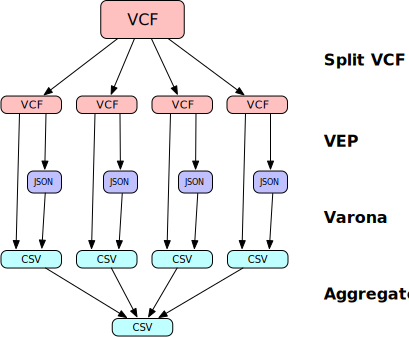

# varona-nf

[Nextflow](https://www.nextflow.io/) pipeline for [Varona](https://github.com/andypohl/varona). *Coming soon!*

The goal is to provide a alternative mechanism to Varona's use of the [Ensembl VEP API](https://rest.ensembl.org/documentation/info/vep_region_post) in order to scale to a larger number of variants.  Below is a diagram of the pipeline illustrating the basic data flow.

